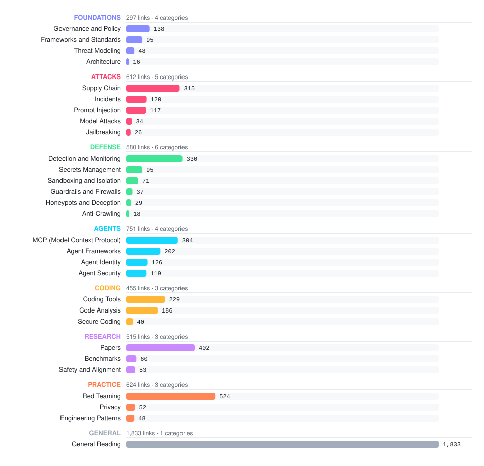
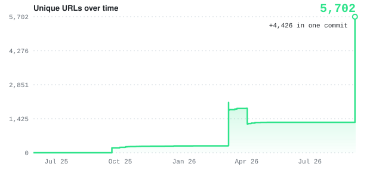
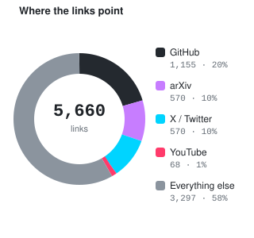
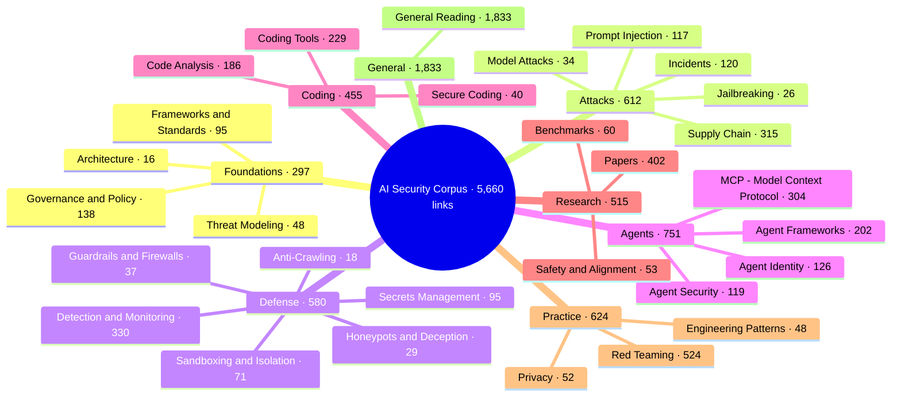

<h1 align="center">AI Security Corpus</h1>

  <b>5,660 links on AI security: prompt injection, LLM and AI agent security, MCP, coding agents, agent skills and supply chain, red teaming, guardrails, sandboxing, incidents and CVEs, governance.</b> 
  One person's reading list that got out of hand. No gatekeeping: if it is even remotely about AI and/or security, it goes in. Added, not endorsed.

  <a href="https://anthonyherman.github.io/ai-security-corpus/"><b>Browse the site</b></a> ·
  <a href="#-foundations">Foundations</a> ·
  <a href="#-attacks">Attacks</a> ·
  <a href="#-defense">Defense</a> ·
  <a href="#-agents">Agents</a> ·
  <a href="#-coding">Coding</a> ·
  <a href="#-research">Research</a> ·
  <a href="#-practice">Practice</a> ·
  <a href="#-general">General</a> ·
  <a href="#by-the-numbers">Stats</a> ·
  <a href="#how-it-is-maintained">Maintenance</a>

---

## By the numbers

<!-- STATS:START -->

  
  
  
  
  
  

<table align="center"><tr>
<td align="center"><h1>5,660</h1>links</td>
<td align="center"><h1>29</h1>categories</td>
<td align="center"><h1>108</h1>sections</td>
<td align="center"><h1>570</h1>arXiv papers</td>
<td align="center"><h1>1,155</h1>GitHub repos</td>
<td align="center"><h1>570</h1>posts on X</td>
</tr></table>

<picture><source media="(prefers-color-scheme: dark)" srcset="assets/categories-dark.svg"></picture>

<table align="center"><tr>
<td><picture><source media="(prefers-color-scheme: dark)" srcset="assets/growth-dark.svg"></picture></td>
<td><picture><source media="(prefers-color-scheme: dark)" srcset="assets/sources-dark.svg"></picture></td>
</tr></table>

<b>Largest sections</b>

| Section | Category | Links |
|---|---|---:|
| Security News and Research | General Reading | 748 |
| AI Industry and Ecosystem | General Reading | 613 |
| Tools | Red Teaming | 340 |
| Resources | Supply Chain | 315 |
| Coding Tools and Assistants | Coding Tools | 206 |

<b>Recently added</b>

- `2026-09-04` [@office-agents/sdk - headless agent runtime SDK for AI-powered Office Add-ins](https://npmjs.com/package/@office-agents/sdk)
- `2026-09-04` [Agent Development Kit - ADK - build multi-agent systems](https://adk.dev)
- `2026-09-04` [agent-browser - browser automation CLI for AI agents](https://github.com/vercel-labs/agent-browser)
- `2026-09-04` [agents-cli - build AI agents on Google Cloud](https://github.com/google/agents-cli)
- `2026-09-04` [ANUS - Autonomous Networked Utility System open-source AI agent framework](https://github.com/nikmcfly/ANUS)
- `2026-09-04` [Azure Functions serverless agents runtime](https://learn.microsoft.com/en-us/azure/azure-functions/functions-serverless-agents-runtime)
- `2026-09-04` [Centaur - self-hosted control plane for sandboxed, credential-safe AI agents in Slack](https://centaur.run)
- `2026-09-04` [CLI-Anything - making all software agent-native](https://github.com/HKUDS/CLI-Anything)

<!-- STATS:END -->

---

## Table of Contents

<!-- TOC:START -->
### 🧱 Foundations

297 links across 4 categories

| Category | Links | Sections | What's inside |
|---|---:|---:|---|
| [Frameworks and Standards](foundations/frameworks-and-standards/README.md) | 95 | 4 | Risk frameworks, standards, and foundational security references |
| [Governance and Policy](foundations/governance-and-policy/README.md) | 138 | 6 | Compliance, AI policy, legal, and trust |
| [Threat Modeling](foundations/threat-modeling/README.md) | 48 | 4 | Threat modeling frameworks, tools, and methodologies |
| [Architecture](foundations/architecture/README.md) | 16 | 2 | Secure AI design patterns and principles |

### 💥 Attacks

612 links across 5 categories

| Category | Links | Sections | What's inside |
|---|---:|---:|---|
| [Prompt Injection](attacks/prompt-injection/README.md) | 117 | 7 | Taxonomy, techniques, datasets, and defenses |
| [Jailbreaking](attacks/jailbreaking/README.md) | 26 | 1 | Jailbreaking techniques and research |
| [Model Attacks](attacks/model-attacks/README.md) | 34 | 5 | Poisoning, backdoors, extraction, and adversarial ML |
| [Supply Chain](attacks/supply-chain/README.md) | 315 | 1 | Dependency attacks, model integrity, and signing |
| [Incidents](attacks/incidents/README.md) | 120 | 5 | Real-world breaches, exploits, and case studies |

### 🛡️ Defense

580 links across 6 categories

| Category | Links | Sections | What's inside |
|---|---:|---:|---|
| [Guardrails and Firewalls](defense/guardrails-and-firewalls/README.md) | 37 | 3 | Guardrails, firewalls, and runtime protection |
| [Sandboxing and Isolation](defense/sandboxing-and-isolation/README.md) | 71 | 3 | Runtime containment and code execution security |
| [Detection and Monitoring](defense/detection-and-monitoring/README.md) | 330 | 4 | Vulnerability scanners and threat detection |
| [Secrets Management](defense/secrets-management/README.md) | 95 | 3 | Protecting secrets from AI agents |
| [Honeypots and Deception](defense/honeypots-and-deception/README.md) | 29 | 2 | Honeypots and adversary engagement |
| [Anti-Crawling](defense/anti-crawling/README.md) | 18 | 3 | Tarpits, cloaking, data poisoning, and crawler access control |

### 🤖 Agents

751 links across 4 categories

| Category | Links | Sections | What's inside |
|---|---:|---:|---|
| [Agent Security](agents/agent-security/README.md) | 119 | 2 | Agent-specific security concerns and threats |
| [Agent Identity](agents/agent-identity/README.md) | 126 | 1 | OAuth, NHI, authentication, and authorization |
| [MCP (Model Context Protocol)](agents/mcp/README.md) | 304 | 12 | Gateways, scanners, research, and tooling |
| [Agent Frameworks](agents/agent-frameworks/README.md) | 202 | 5 | General agent frameworks, platforms, and tools |

### ⌨️ Coding

455 links across 3 categories

| Category | Links | Sections | What's inside |
|---|---:|---:|---|
| [Secure Coding](coding/secure-coding/README.md) | 40 | 3 | Rules files, vibe coding security, and secure prompt engineering |
| [Code Analysis](coding/code-analysis/README.md) | 186 | 3 | SAST, code review, and vulnerability scanning |
| [Coding Tools](coding/coding-tools/README.md) | 229 | 2 | IDE integrations, copilots, and assistants |

### 📚 Research

515 links across 3 categories

| Category | Links | Sections | What's inside |
|---|---:|---:|---|
| [Papers](research/papers/README.md) | 402 | 8 | Academic papers and surveys |
| [Benchmarks](research/benchmarks/README.md) | 60 | 3 | Evaluation frameworks and datasets |
| [Safety and Alignment](research/safety-and-alignment/README.md) | 53 | 2 | AI safety, alignment, and privacy |

### 🎯 Practice

624 links across 3 categories

| Category | Links | Sections | What's inside |
|---|---:|---:|---|
| [Red Teaming](practice/red-teaming/README.md) | 524 | 3 | Offensive AI security, tools, and methodologies |
| [Engineering Patterns](practice/engineering-patterns/README.md) | 48 | 2 | Harness engineering and building patterns |
| [Privacy](practice/privacy/README.md) | 52 | 4 | Data leakage, PII protection, and exfiltration |

### 📰 General

1,833 links across 1 category

| Category | Links | Sections | What's inside |
|---|---:|---:|---|
| [General Reading](general/README.md) | 1,833 | 5 | Blog posts, talks, opinion, commentary, and security news |
<!-- TOC:END -->

---

## Lists and Aggregators

- [Awesome LLM Security (corca-ai)](https://github.com/corca-ai/awesome-llm-security)
- [Awesome LLM Safety](https://github.com/ydyjya/Awesome-LLM-Safety)
- [Awesome LLM Security (christiancscott)](https://github.com/christiancscott/awesome-LLM-security)
- [Awesome LLM Supply Chain Security](https://github.com/ShenaoW/awesome-llm-supply-chain-security)
- [Awesome LLMSecOps](https://github.com/wearetyomsmnv/Awesome-LLMSecOps)
- [Awesome LLM Agent Security](https://github.com/wearetyomsmnv/Awesome-LLM-agent-Security)
- [Awesome LM-SSP](https://github.com/ThuCCSLab/Awesome-LM-SSP)
- [System Prompt Leaks](https://github.com/asgeirtj/system_prompts_leaks)
- [AI Security Forum Quick List](https://aisecurityforum.substack.com/p/quick-list-of-high-impact-ai-security)
- [Awesome AI Security (TalEliyahu)](https://github.com/TalEliyahu/Awesome-AI-Security)

## System Prompts

- [System Prompts and Models of AI Tools](https://github.com/x1xhlol/system-prompts-and-models-of-ai-tools)

## Prompt Design

- [Google Vertex AI - Introduction to Prompt Design](https://cloud.google.com/vertex-ai/generative-ai/docs/learn/prompts/introduction-prompt-design)
- [Learn Prompting](https://learnprompting.org/docs/introduction)
- [PromptZ2H](https://promptz2h.com/)

---

## How it is maintained

Every category is a plain markdown file of `- [Title](url)` lines under `## ` sections, so the whole thing greps, diffs, and forks cleanly.

| What | How |
|---|---|
| Add links | `/add-resource <url> [url2] ...` — an agent command that fetches titles, classifies each link into the right file and section, and commits. The rules live in [`agents.md`](agents.md), so any coding agent that reads it can do the same |
| Search | `/search-resources <query>` — grep across every category file |
| Obsidian vault | `python3 scripts/sync-vault.py` regenerates [`vault/`](vault/) with one note per category, wiki-linked and tagged |
| Website | `python3 scripts/build-site.py` renders every category to a static page at [anthonyherman.github.io/ai-security-corpus](https://anthonyherman.github.io/ai-security-corpus/) with client-side search (deployed by CI on every push) |
| Stats and charts | `python3 scripts/stats.py` recounts the corpus, redraws the SVGs in [`assets/`](assets/), and rewrites the numbers above (also runs in CI on every push) |

Links are added, not endorsed. Some of them are wrong, some are marketing, some are exploits. That is the corpus.

Licensed <a href="LICENSE">CC BY 4.0</a>: fork it, grep it, republish it, just link back.

<a href="#by-the-numbers">↑ back to top</a>

